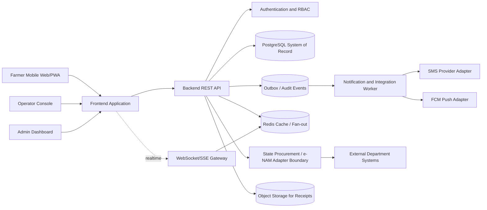
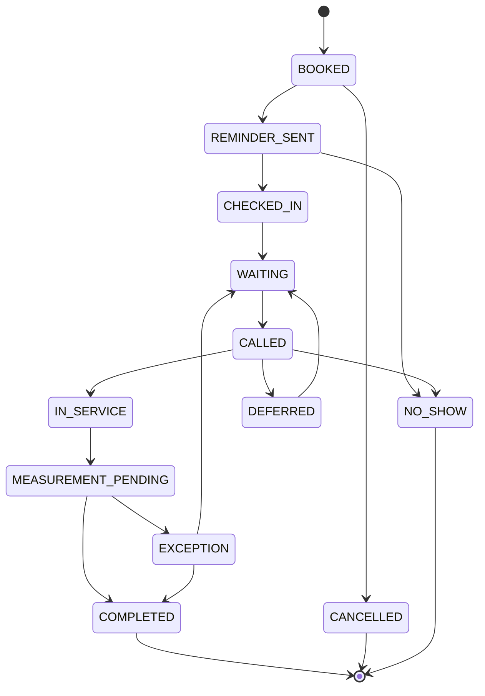
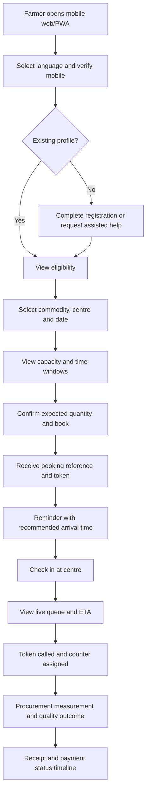
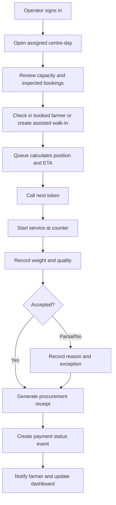

# ProcureFlow — Smart Procurement Centre Queue and Status Platform

## Product Requirements Document

**Problem Statement ID:** 26032  
**Problem Statement Title:** Farmers often face long waiting times, lack of information regarding procurement schedules, and uncertainty about procurement status.  
**Organization:** Ministry of Consumer Affairs, Food & Public Distribution  
**Department:** Department of Consumer Affairs (DoCA)  
**Category:** Software  
**Theme:** Smart Automation  
**Document purpose:** Implementation-ready product and architecture specification for a six-member third-year student team using Antigravity.  
**Document status:** Prototype PRD for SIH 2026  
**Author:** Manus AI  

> **Important scope boundary:** This document specifies the product, data model, interfaces, architecture, and deployment design. It intentionally contains no application source code.

---

## 1. Executive Summary

Farmers who sell eligible produce through government procurement centres commonly face three operational uncertainties: they do not know when they should arrive, they cannot see how many farmers are ahead of them, and they do not have a reliable, unified view of procurement and payment progress after the sale. Procurement staff also lack a simple operational view of daily capacity, arrivals, no-shows, active counters, pending measurements, and congestion.

**ProcureFlow** is a multilingual, low-bandwidth, farmer-first platform that converts a physical procurement-centre visit into a transparent digital journey. A farmer registers or is assisted by an operator, selects a procurement centre and available slot, receives a virtual token, watches queue progress, checks in at the centre, receives procurement and payment updates, and gets SMS/app notifications at important transitions. Centre operators receive a live operations console for managing daily capacity, arrivals, service counters, measurements, exceptions, and queue movement. District or department administrators receive cross-centre dashboards, audit trails, and configuration controls.

The prototype is not a replacement for e-NAM, state procurement systems, payment rails, Aadhaar services, or departmental ledgers. It is an **operational orchestration and communication layer** that can start with mock or manually entered procurement data and later integrate with state systems through adapters. e-NAM already provides a national electronic market and market-facing features, while Odisha and West Bengal demonstrate separate state-level registration, procurement, scheduling, and payment-status modules. The opportunity for this prototype is to unify the physical centre workflow and live queue experience that is not clearly exposed as one farmer journey in those benchmarks.[1] [2] [3]

### 1.1 Proposed product name

The working name is **ProcureFlow**. The name may be changed by the team after validation with mentors or department stakeholders.

### 1.2 One-sentence value proposition

> **ProcureFlow tells every farmer where to go, when to arrive, how long the wait may be, what happened to the produce, and when payment is expected—while helping procurement staff control centre congestion.**

---

## 2. Problem Statement and Detailed Interpretation

### 2.1 Official problem statement

> Farmers often face long waiting times, lack of information regarding procurement schedules, and uncertainty about procurement status.
>
> Expected solution: develop a platform that enables farmer registration and slot booking, provides real-time queue management, sends SMS/app notifications, tracks procurement and payment status, and reduces congestion and waiting time at procurement centres.

### 2.2 Operational reality represented by the statement

The statement is not only a booking problem. It is a coordination problem involving several actors and a chain of dependent events.

| Stage | Current uncertainty | Required product response |
|---|---|---|
| Registration | Is the farmer registered for the current procurement season and commodity? | Guided registration, assisted registration, document/identity status, season eligibility. |
| Slot discovery | Which centre is open, what dates are available, and how much capacity remains? | Centre search, calendar, capacity display, and accessible alternatives. |
| Booking | Is the slot confirmed, pending, cancelled, or full? | Idempotent booking, token number, confirmation, cancellation and rescheduling rules. |
| Travel and arrival | Should the farmer leave now or wait? | Recommended arrival window, reminders, queue position, ETA, and centre status. |
| Physical service | How many farmers are ahead and which counter is serving the farmer? | Check-in, virtual queue, counter assignment, no-show handling, and operator controls. |
| Procurement | Was the produce accepted, weighed, quality-checked, and recorded? | Procurement timeline with quantity, quality outcome, receipt, exceptions, and operator attribution. |
| Payment | Has payment been initiated, processed, failed, or completed? | Farmer-readable payment states, expected date, masked bank destination, and escalation path. |
| Administration | Which centres are congested or underperforming? | District dashboard, centre comparison, audit logs, alerts, and exportable reports. |

### 2.3 Primary pain points

The central pain is the cost of uncertainty. A farmer may lose a working day travelling to a centre that is overloaded, arrive outside the effective service window, wait without knowing the queue position, or repeatedly contact staff to ask whether payment has been made. Congestion also creates avoidable crowding, manual errors, disputes about turn order, and poor visibility for supervisors.

The prototype should therefore optimize for **predictability, transparency, and assisted access**, not merely for the number of digital features.

### 2.4 Assumptions for the SIH prototype

The prototype will model one state or district, one or two commodities, a small number of procurement centres, and a controlled demo dataset. It will support three user roles: farmer, centre operator, and administrator. A notification provider may be mocked or sandboxed during demonstration. Payment status may be simulated or imported manually because actual government payment integration requires authorization and department-specific interfaces.

The prototype should be designed so that a farmer can use a mobile browser or PWA, while an operator uses a responsive web console. A farmer who cannot use the application can be registered and booked by an operator on the farmer’s behalf.

---

## 3. Research Findings and Competitive/Comparable Analysis

### 3.1 Existing platforms and what they do well

| Platform or benchmark | Documented strengths | What ProcureFlow should learn | Observable gap relevant to SIH 26032 |
|---|---|---|---|
| **e-NAM** | Pan-India electronic trading portal connecting APMC mandis; registration, mandi discovery, dashboards, price information, mobile app, logistics, FPO and cooperative modules. Its stated vision includes reducing information asymmetry and enabling real-time price discovery.[1] | Use modular stakeholder design, multilingual access, mandi/market master data, and transparent status presentation. | It is primarily a national agricultural market and trading platform. The public portal does not present the entire physical procurement-centre appointment, live queue, check-in, and payment-timeline journey as one farmer workflow. |
| **Odisha Food Supplies Transparency Portal / PPAS** | Exposes farmer registration status, procurement status under PPAS, farmerwise payment status, procurement societies, market yards, mills, depots, and related reports.[2] | Separate procurement and payment status views are valuable and should be reflected in a farmer-readable timeline and administrator reports. | The public experience is distributed across reports and appears more suited to status lookup than live queue orchestration and proactive notifications. |
| **West Bengal Online Paddy Procurement System** | Shows procurement-centre categories, registered farmers, procured quantity, procurement value, benefited farmers, scheduled camps, and a Farmer Schedule Status table containing centre, slot creation date, slot date, scheduled quantity, sold quantity, cancellation date, and status. It also exposes farmer eKYC and OTP flows.[3] | Model centre types, schedule records, quantities, cancellations, and farmer schedule history. | The public page does not evidence live queue position, estimated waiting time, check-in state, active service counters, congestion alerts, or an integrated notification timeline. |
| **Generic queue-management systems** | Typically provide ticket generation, counter management, queue display, and real-time queue movement.[4] | Adopt the concepts of virtual tickets, counter status, estimated wait, and operator-controlled queue transitions. | Generic systems do not understand procurement seasons, farmer eligibility, produce quantity, quality checks, procurement receipts, or government payment status. |

### 3.2 Differentiation for the proposed project

ProcureFlow’s unique value is the combination of **season-aware procurement scheduling**, **virtual queue management**, and **end-to-end procurement/payment timeline** in a single farmer experience. Existing systems commonly expose one or more of these capabilities, but the prototype will connect them around the actual centre visit.

The differentiators are as follows:

1. **Queue-aware slot booking.** A slot is not only a date. It is linked to centre capacity, expected quantity, service duration, and a virtual token. The system can recommend a less congested centre or time window.
2. **Live farmer position and ETA.** After check-in, the farmer sees people ahead, current token being served, estimated waiting time, counter status, and a reminder threshold.
3. **Centre congestion intelligence.** The operator dashboard shows planned capacity versus actual arrivals, queue depth, no-shows, average service time, pending measurement, and predicted overload.
4. **One timeline from registration to payment.** The farmer receives a human-readable sequence of events rather than searching separate reports.
5. **Assisted and low-connectivity access.** Operators can perform assisted registration and booking; notification delivery is abstracted so SMS can remain available when app push is not.
6. **Auditable state transitions.** Each important action records who performed it, when it occurred, and the previous and new state. This reduces disputes and makes the demo credible for a government workflow.
7. **Integration-ready design.** The prototype uses internal domain entities and adapter boundaries so e-NAM/state procurement/payment systems can be connected later without rewriting the farmer experience.

### 3.3 Product positioning

ProcureFlow should be positioned as an **operational coordination layer for procurement centres**, not as a commodity marketplace or a replacement for government systems. This positioning keeps the MVP achievable for students and aligns the product with the specific pain in the problem statement.

---

## 4. Goals, Non-Goals, and Success Metrics

### 4.1 Product goals

| Goal | Prototype interpretation |
|---|---|
| Reduce waiting and congestion | Demonstrate slot capacity, virtual queue, check-in, active counter management, and ETA. |
| Improve farmer information | Provide multilingual schedule, token, queue, procurement, and payment status. |
| Reduce staff coordination effort | Provide an operator dashboard instead of paper lists and repeated phone calls. |
| Improve transparency | Show immutable event history and farmer-readable reasons for cancellation, rejection, or payment delay. |
| Remain feasible for a six-member student team | Keep the MVP modular, use managed infrastructure, mock external integrations, and limit the demo to one district and selected commodities. |

### 4.2 Non-goals for the prototype

The prototype will not perform real Aadhaar authentication, make actual bank transfers, determine government MSP policy, replace quality laboratory equipment, legally certify procurement records, or integrate with every state portal. It will not attempt a nationwide rollout, full offline synchronization, advanced AI price prediction, or biometric hardware integration in the first release.

### 4.3 Success metrics for the demo

| Metric | Target for prototype validation |
|---|---:|
| Farmer completes registration and slot booking | Within 3 minutes in a guided usability test. |
| Farmer can find current token and queue status | Within 15 seconds from dashboard. |
| Operator can open a centre day and create capacity | Within 2 minutes. |
| Operator can move a token through check-in to completed procurement | Within 3 minutes for a demo record. |
| Queue update propagation | Visible to connected clients within 5 seconds in the demo environment. |
| Notification event creation | Recorded in the notification log within 3 seconds; provider delivery may be mocked. |
| Duplicate booking prevention | No duplicate active booking for the same farmer, season, centre-day, and produce lot. |
| Audit completeness | Every queue, procurement, payment, cancellation, and notification transition has an actor and timestamp. |
| Accessibility | Core farmer flow usable on a low-end mobile viewport and in at least English plus one Indian language for the demo. |

---

## 5. Users, Roles, and Permissions

| Role | Main responsibilities | Key permissions |
|---|---|---|
| Farmer | Register, maintain profile, select centre/slot, view token, check in, view procurement and payment status, receive notifications. | Read own records; create/update own booking; cancel within policy; no access to another farmer’s data. |
| Assisted-service operator | Register farmers who need help, create bookings, verify arrival, manage token flow, record weights and procurement outcomes. | Create and update farmer records within assigned centre/district; manage queue and procurement events; cannot change system-wide policy. |
| Centre manager | Configure centre-day capacity, assign counters, monitor congestion, approve exceptions, review daily reconciliation. | Manage centre operations, reassign staff/counters, override queue with reason, close centre day. |
| District administrator | Monitor all centres, configure seasons/commodities, manage users, view reports and audit logs. | Cross-centre read access; configuration and reporting; controlled administrative overrides. |
| Notification worker | Process notification jobs and record delivery outcomes. | Access only notification payloads and templates; no direct modification of procurement records. |
| Integration administrator | Configure external-system adapters and import/export mappings. | Manage connector configuration and mapping metadata; no business override without audit reason. |

Role-based access control must be enforced server-side. The client interface must hide unavailable actions, but hidden buttons must never be treated as authorization.

---

## 6. Functional Requirements

### 6.1 Farmer registration and profile

| ID | Requirement | Priority | Acceptance criterion |
|---|---|---|---|
| FR-001 | The system shall allow a farmer to register using mobile number, name, preferred language, village, district, land/farmer identifier where applicable, and bank/payment reference details in masked form. | Must | Valid form creates a farmer profile and verification state. |
| FR-002 | The system shall support operator-assisted registration. | Must | Operator can create a farmer profile with an `assisted_by` audit entry. |
| FR-003 | The system shall maintain season and commodity eligibility separately from the core profile. | Must | A farmer may be eligible for one season/commodity and pending for another. |
| FR-004 | The system shall provide OTP-ready verification abstraction. | Should | Demo can use a mock OTP provider while preserving the same verification states. |
| FR-005 | The farmer shall be able to view and correct non-sensitive profile fields. | Should | Changes are logged and do not silently alter historical bookings. |

### 6.2 Centre discovery and slot booking

| ID | Requirement | Priority | Acceptance criterion |
|---|---|---|---|
| FR-101 | The farmer shall search available centres by district, distance approximation, commodity, date, and capacity. | Must | Results show centre status, remaining capacity, and next available slot. |
| FR-102 | The system shall represent procurement capacity by centre, season, commodity, date, time window, and expected quantity. | Must | A slot cannot be booked beyond configured quantity or farmer-count capacity. |
| FR-103 | The system shall create a unique booking reference and virtual token. | Must | Repeated requests do not create duplicate active bookings. |
| FR-104 | The system shall support cancellation and rescheduling subject to configurable cut-off rules. | Must | Cancelled tokens are not served and capacity is released according to policy. |
| FR-105 | The system shall recommend alternative slots or centres when the requested option is full. | Should | At least three alternatives are shown when available. |
| FR-106 | The system shall show centre instructions, opening hours, required documents, and accepted commodities. | Must | Farmer can access instructions before confirming a booking. |

### 6.3 Queue management

| ID | Requirement | Priority | Acceptance criterion |
|---|---|---|---|
| FR-201 | The system shall create a queue entry when a booking is confirmed or when an operator adds a walk-in according to policy. | Must | Queue entry has a unique token, priority class, and state. |
| FR-202 | The system shall support queue states: `BOOKED`, `REMINDER_SENT`, `CHECKED_IN`, `WAITING`, `CALLED`, `IN_SERVICE`, `MEASUREMENT_PENDING`, `COMPLETED`, `NO_SHOW`, `CANCELLED`, `DEFERRED`, and `EXCEPTION`. | Must | Only configured valid transitions are allowed. |
| FR-203 | The farmer shall see position ahead, current serving token, approximate wait, and last refresh time. | Must | Values update after queue events or periodic refresh. |
| FR-204 | The operator shall call, skip, recall, defer, and complete a token with a reason where required. | Must | Each action records actor, timestamp, previous state, new state, and reason. |
| FR-205 | The system shall support configurable priority policies for elderly, disabled, or other authorized categories without allowing arbitrary operator favoritism. | Should | Priority is selected from a policy-controlled list and audit logged. |
| FR-206 | The centre dashboard shall show active counters, queue depth, average service time, no-shows, and overload warning. | Must | Dashboard updates when queue or counter data changes. |

### 6.4 Procurement recording

| ID | Requirement | Priority | Acceptance criterion |
|---|---|---|---|
| FR-301 | The operator shall record produce arrival, gross weight, tare weight, net quantity, quality result, deductions where applicable, agreed rate, and gross payable amount. | Must | A procurement record cannot be completed without required fields and actor identity. |
| FR-302 | The system shall generate a farmer-readable procurement receipt/reference. | Must | Receipt includes centre, date, commodity, quantity, rate, amount, and status. |
| FR-303 | The system shall allow `ACCEPTED`, `PARTIALLY_ACCEPTED`, `REJECTED`, and `PENDING_REVIEW` outcomes with reasons. | Must | Rejections and partial acceptance require a reason category. |
| FR-304 | The system shall retain amendments as new events rather than silently overwriting the original measurement. | Must | Audit history shows old and new values. |

### 6.5 Payment status

| ID | Requirement | Priority | Acceptance criterion |
|---|---|---|---|
| FR-401 | The system shall track payment states `NOT_INITIATED`, `INITIATED`, `PROCESSING`, `PAID`, `FAILED`, `ON_HOLD`, and `DISPUTED`. | Must | State changes are validated and logged. |
| FR-402 | The farmer shall view payment status, amount, reference, last update, and next action without exposing full bank details. | Must | Sensitive account data is masked. |
| FR-403 | The operator or administrator shall be able to import or manually update payment status in the prototype. | Must | Manual updates require reason and actor. |
| FR-404 | Payment updates shall be decoupled from procurement completion. | Must | Procurement may be completed while payment remains processing or on hold. |

### 6.6 Notifications

| ID | Requirement | Priority | Acceptance criterion |
|---|---|---|---|
| FR-501 | The platform shall generate notification events for registration, booking, reminder, queue threshold, centre delay, token call, procurement receipt, payment update, cancellation, and exception. | Must | Each event is persisted before delivery attempt. |
| FR-502 | Notifications shall support in-app/push and SMS channel abstractions. | Must | The demo can use a mock provider while displaying delivery logs. |
| FR-503 | The farmer shall be able to choose language and notification preferences where policy allows. | Should | Template selection follows farmer preference and fallback language. |
| FR-504 | Notification retries shall use bounded retry policy and avoid duplicate sends through idempotency keys. | Must | Replaying a job does not create duplicate logical notifications. |

### 6.7 Administration, reports, and audit

| ID | Requirement | Priority | Acceptance criterion |
|---|---|---|---|
| FR-601 | Administrators shall configure seasons, commodities, centres, centre-days, slot capacity, service windows, and notification templates. | Must | Configuration changes are role restricted and audited. |
| FR-602 | Administrators shall view centre-level and district-level metrics. | Must | Dashboard supports date, season, centre, and commodity filters. |
| FR-603 | The system shall maintain an audit log for security and business events. | Must | Audit record includes actor, action, entity, before/after summary, timestamp, and request correlation ID. |
| FR-604 | Reports shall be exportable as CSV for the prototype. | Should | Export respects role permissions and selected filters. |

---

## 7. Non-Functional Requirements

| Area | Requirement |
|---|---|
| Performance | Standard read requests should target p95 below 500 ms in the prototype environment; queue updates should be visible to connected users within 5 seconds. |
| Availability | The demo should recover from a restarted frontend or worker without losing confirmed bookings or audit records. |
| Consistency | Booking capacity and token creation must be transactionally protected against double booking. |
| Security | Use HTTPS in deployment, hashed passwords or managed authentication, role-based access control, server-side validation, rate limits on OTP/auth endpoints, and masked sensitive fields. |
| Privacy | Collect only fields required for the prototype; never store raw Aadhaar numbers or full bank account numbers. Use synthetic demo data. |
| Accessibility | Mobile-first layout, readable contrast, keyboard support for operator console, clear status labels, and multilingual-ready content. |
| Localization | All user-facing strings must come from translation keys. The demo should include English and one Indian language; the data model must support additional languages. |
| Auditability | Every business-critical transition must be traceable and immutable at the event level. |
| Scalability | A single district and approximately 10 centres should be supported comfortably; schema and service boundaries should allow future horizontal scaling. |
| Observability | Log request ID, user ID/role, centre ID, event type, latency, and error class without logging sensitive values. |
| Resilience | Notification provider failure must not block booking or procurement transactions; failed delivery should be retried and surfaced. |

---

## 8. Recommended Technical Stack and Validation

The stack should prioritize student familiarity, fast iteration, managed deployment, strong relational consistency, and clear separation between frontend and backend.

| Layer | Recommendation | Reason for selection and validation |
|---|---|---|
| Frontend | React with TypeScript, Vite, and a responsive component system; PWA capability for farmer access. | Large ecosystem, type safety, fast development, reusable farmer/operator interfaces, and suitability for mobile web. |
| Routing and data fetching | React Router and a query/cache library such as TanStack Query. | Separates route state from server state, supports loading/error states, and reduces duplicate network logic. |
| Backend API | Node.js with TypeScript and a structured HTTP framework such as NestJS or Fastify. | Fits a student JavaScript/TypeScript team, supports modular services, validation, authentication middleware, and API documentation. Choose one framework before implementation; do not mix frameworks. |
| API contract | REST JSON with OpenAPI documentation. | Easy to test from Antigravity, Postman, frontend, and demo scripts; suitable for resource-oriented entities. |
| Primary database | PostgreSQL. | Procurement, capacity, booking, queue, payment, and audit data require relational integrity. PostgreSQL documentation explains that indexes speed retrieval, constraints enforce data validity, and transaction isolation is important for preventing conflicting concurrent booking updates.[5] [6] [7] |
| Cache/realtime acceleration | Redis for short-lived queue snapshots, rate limits, and realtime fan-out; WebSocket or Server-Sent Events for connected dashboards. | Redis Pub/Sub is suitable for transient broadcasts, but its official documentation states at-most-once delivery, so it must not be the sole source of truth. Durable events remain in PostgreSQL or an outbox table.[8] [9] |
| Notifications | Firebase Cloud Messaging for web/app push plus an SMS provider adapter. | FCM officially supports sending notification messages to clients; the provider adapter keeps the product independent of a single SMS vendor.[10] |
| Authentication | Managed email/password or OTP-ready authentication for prototype users; production identity must be replaced or integrated with department-approved identity services. | Avoid storing passwords or building insecure authentication from scratch. |
| File/object storage | S3-compatible object storage for optional receipts or centre documents. | Keeps files outside the relational database and supports future evidence attachments. |
| Background processing | A worker process consuming notification/outbox jobs. | Keeps slow SMS/push provider calls out of the booking transaction. |
| Testing | Unit tests for state transitions and capacity rules; API integration tests; end-to-end tests for farmer and operator journeys. | The highest-risk logic is booking concurrency and queue transitions, so test these before visual polish. |
| Deployment | Managed frontend hosting, managed Node backend, managed PostgreSQL, managed Redis, and environment secrets. | Minimizes DevOps burden for students while preserving production-like separation. |

### 8.1 Technology decision rules

The team should select one primary stack and avoid adding technologies merely for novelty. PostgreSQL is the system of record. Redis is an optimization, not a source of truth. Push and SMS are delivery channels, not the business event store. The backend owns all state transitions. The frontend must not calculate authoritative queue position, capacity, payment amount, or eligibility.

### 8.2 Why a relational database is essential

The system has strong relationships and invariants: one farmer can have limited active bookings, a slot cannot exceed capacity, a queue token belongs to one centre-day, a procurement record references a booking or assisted walk-in, and payment status follows an auditable lifecycle. PostgreSQL constraints and indexes are directly relevant to these requirements.[5]

### 8.3 Why realtime must be separated from durability

A queue update can be broadcast through WebSocket/SSE and accelerated through Redis, but a lost message must not lose the business event. Each queue transition should first be committed to PostgreSQL and an outbox/event record. Realtime clients can refresh from the API if they miss a broadcast. This design follows the distinction between transient Pub/Sub delivery and durable state.[8] [9]

---

## 9. High-Level Architecture



### 9.1 Architectural principles

The backend is the authority for eligibility, capacity, booking, queue transitions, procurement totals, payment state, and permissions. The database stores current state plus immutable business events. Notification delivery is asynchronous. External integrations are behind adapters. All mutations are idempotent where retries are possible. The centre dashboard and farmer dashboard consume the same domain events but expose different fields according to role.

### 9.2 Main backend modules

| Module | Responsibilities |
|---|---|
| Identity and access | Authentication, session/token validation, role assignment, centre/district scope. |
| Farmer registry | Profiles, language, eligibility, verification, assisted registration. |
| Master data | Districts, centres, commodities, seasons, policies, service windows, status dictionaries. |
| Slot and capacity | Centre-days, time windows, capacity by quantity and farmer count, availability, alternatives. |
| Booking | Idempotent booking, cancellation, rescheduling, token allocation, booking history. |
| Queue | Check-in, position, counter assignment, call/skip/recall, no-show, deferral, ETA. |
| Procurement | Weighing, quality, accepted quantity, rate, receipt, exception and correction events. |
| Payments | Payment state, amount, reference, failure/on-hold reason, manual/import updates. |
| Notifications | Templates, preferences, outbox, provider adapters, retry and delivery log. |
| Reporting | Centre, district, season, commodity, throughput, wait time, payment aging, exports. |
| Audit | Immutable business and administrative actions with correlation IDs. |
| Integration boundary | Import/export mapping and future connections to state procurement, e-NAM, payment, and messaging services. |

---

## 10. Low-Level Data Architecture and Backend Schema

The following schema is conceptual. Antigravity should turn it into migrations and ORM models during implementation. Names are stable recommendations, not code.

### 10.1 Core entities

| Entity | Important fields | Relationships and rules |
|---|---|---|
| `users` | `id`, `role`, `name`, `mobile`, `email`, `status`, `last_login_at`, timestamps | One user may be linked to a farmer or staff profile. Mobile/email uniqueness depends on identity policy. |
| `farmer_profiles` | `id`, `user_id`, `farmer_ref`, `preferred_language`, `village`, `district_id`, `masked_payment_ref`, `verification_status`, `assisted_by_user_id` | One farmer may have many season eligibilities and bookings. Raw Aadhaar must not be stored. |
| `staff_profiles` | `id`, `user_id`, `staff_code`, `district_id`, `centre_id`, `designation` | Scope permissions to assigned district/centre. |
| `districts` | `id`, `name`, `state_code`, `active` | Parent for centres and farmer locality. |
| `centres` | `id`, `district_id`, `code`, `name`, `address`, `latitude`, `longitude`, `centre_type`, `opening_time`, `closing_time`, `status` | Centre belongs to one district; may have multiple centre-days. |
| `commodities` | `id`, `code`, `name`, `unit`, `active` | Used by eligibility, capacity, procurement, and pricing. |
| `procurement_seasons` | `id`, `name`, `kms_year`, `season_type`, `start_date`, `end_date`, `status` | A season controls eligibility and centre-day booking. |
| `farmer_eligibilities` | `id`, `farmer_id`, `season_id`, `commodity_id`, `status`, `verified_at`, `source` | Unique by farmer, season, commodity. |
| `centre_days` | `id`, `centre_id`, `season_id`, `commodity_id`, `service_date`, `status`, `planned_capacity_qty`, `planned_farmer_count` | Unique by centre, season, commodity, service date. |
| `slot_windows` | `id`, `centre_day_id`, `start_time`, `end_time`, `capacity_qty`, `capacity_farmer_count`, `booked_qty`, `booked_farmer_count`, `status` | Capacity must never be negative or exceed configured limits. |
| `bookings` | `id`, `booking_ref`, `farmer_id`, `centre_day_id`, `slot_window_id`, `expected_qty`, `token_no`, `status`, `idempotency_key`, timestamps | One active booking per farmer/season/centre-day policy; token unique within centre-day. |
| `queue_entries` | `id`, `booking_id`, `centre_day_id`, `priority_class`, `position_snapshot`, `eta_seconds`, `state`, `checked_in_at`, `called_at`, `service_started_at`, `completed_at` | One queue entry per booking; walk-ins may reference an assisted registration. |
| `service_counters` | `id`, `centre_id`, `counter_code`, `counter_type`, `status`, `current_queue_entry_id`, `staff_user_id` | Counter assignment is optional until service begins. |
| `procurement_records` | `id`, `booking_id`, `receipt_ref`, `commodity_id`, `gross_weight`, `tare_weight`, `net_quantity`, `quality_status`, `accepted_quantity`, `rate`, `gross_amount`, `deduction_amount`, `net_amount`, `outcome`, `recorded_by`, timestamp | One current record with immutable amendment events. |
| `payment_records` | `id`, `procurement_id`, `payment_ref_masked`, `amount`, `status`, `expected_at`, `processed_at`, `failure_reason`, `last_updated_by` | One or more attempts may exist; farmer sees safe summary. |
| `notification_templates` | `id`, `event_type`, `language`, `channel`, `template_text`, `active`, `version` | Version templates rather than mutating historical message meaning. |
| `notification_jobs` | `id`, `farmer_id`, `event_id`, `channel`, `template_id`, `idempotency_key`, `status`, `attempt_count`, `next_attempt_at` | Durable outbox work item. |
| `notification_deliveries` | `id`, `job_id`, `provider`, `provider_ref`, `status`, `error_code`, `sent_at`, `delivered_at` | Delivery attempts are separate from logical notification. |
| `business_events` | `id`, `event_type`, `entity_type`, `entity_id`, `actor_user_id`, `centre_id`, `payload_summary`, `correlation_id`, `occurred_at` | Append-only audit/business event stream. Do not store unnecessary personal data in payload. |
| `integration_records` | `id`, `system_name`, `external_entity_type`, `external_id`, `internal_entity_id`, `last_sync_at`, `sync_status`, `error_summary` | Supports later state-system adapters and reconciliation. |

### 10.2 Recommended indexes and constraints

| Table | Index or constraint | Purpose |
|---|---|---|
| `farmer_profiles` | Unique index on normalized `farmer_ref`; index on `district_id` and `preferred_language` | Fast lookup and duplicate prevention. |
| `farmer_eligibilities` | Unique composite constraint on `farmer_id`, `season_id`, `commodity_id`; index on `status` | Prevent duplicate eligibility and filter pending/verified farmers. |
| `centre_days` | Unique composite constraint on `centre_id`, `season_id`, `commodity_id`, `service_date`; index on `service_date`, `status` | Prevent duplicate operational days and find active days. |
| `slot_windows` | Index on `centre_day_id`, `start_time`; check constraints for non-negative capacities and `booked <= capacity` | Fast availability and safe capacity. |
| `bookings` | Unique index on `booking_ref`; unique index on `idempotency_key`; composite partial unique index for active farmer booking policy; index on `centre_day_id`, `status`, `token_no` | Idempotency, double-booking prevention, and queue lookup. |
| `queue_entries` | Index on `centre_day_id`, `state`, `priority_class`, `created_at`; unique index on `centre_day_id`, `booking_id` | Queue retrieval and one entry per booking. |
| `procurement_records` | Unique index on `receipt_ref`; index on `booking_id`, `outcome`; check constraints for non-negative weights and amounts | Receipt uniqueness and valid measurements. |
| `payment_records` | Index on `status`, `expected_at`; unique index on `payment_ref_masked` only if the external reference is guaranteed unique | Payment aging and reconciliation. |
| `business_events` | Index on `entity_type`, `entity_id`, `occurred_at`; index on `centre_id`, `occurred_at`; index on `correlation_id` | Audit timeline and traceability. |
| `notification_jobs` | Unique index on `idempotency_key`; index on `status`, `next_attempt_at` | Safe retries and worker polling. |

### 10.3 Booking transaction rule

Booking creation must execute in one database transaction. The backend should lock or atomically update the relevant slot capacity, verify farmer eligibility and active-booking policy, create the booking, allocate a token, append a business event, and enqueue a notification/outbox record. If any step fails, none of the business state should be committed.

### 10.4 Queue-state machine



Every transition must be validated against the state machine. A centre manager may perform an override only by selecting an allowed override action and entering a reason.

---

## 11. API Contract and Payload Design

The API should be RESTful, JSON-based, versioned under `/api/v1`, and documented through OpenAPI. All mutation endpoints should accept an `Idempotency-Key` header where retries could duplicate a booking, procurement record, payment update, or notification event.

### 11.1 Standard response envelope

Successful responses should contain a stable `data` object, a `meta` object for pagination or server time, and a request/correlation identifier. Errors should contain a machine-readable error code, human-readable message, field errors where relevant, and the correlation ID. Exact implementation formatting may be finalized by the backend lead.

### 11.2 Authentication and user endpoints

| Method and route | Purpose | Important request fields | Important response fields |
|---|---|---|---|
| `POST /api/v1/auth/request-otp` | Request verification challenge | `mobile`, `purpose`, `locale` | `challenge_id`, expiry, masked destination |
| `POST /api/v1/auth/verify-otp` | Verify challenge | `challenge_id`, `otp` | access/session token, user role, profile summary |
| `GET /api/v1/me` | Current user and permissions | None | user, roles, scope, farmer/staff profile |
| `PATCH /api/v1/me/preferences` | Update language/notification preferences | `preferred_language`, channels | updated preferences |

### 11.3 Farmer and eligibility endpoints

| Method and route | Purpose | Important request fields | Important response fields |
|---|---|---|---|
| `POST /api/v1/farmers` | Create farmer or assisted registration | profile fields, verification metadata | farmer profile, eligibility summary |
| `GET /api/v1/farmers/{farmerId}` | Read authorized farmer profile | path ID | safe profile and status |
| `PATCH /api/v1/farmers/{farmerId}` | Update permitted fields | editable profile fields | updated profile |
| `GET /api/v1/farmers/{farmerId}/eligibilities` | List season/commodity eligibility | filters | eligibility list |
| `POST /api/v1/farmers/{farmerId}/eligibilities` | Create or import eligibility | `season_id`, `commodity_id`, `status`, `source` | eligibility record |

### 11.4 Centre, availability, and booking endpoints

| Method and route | Purpose | Important request fields | Important response fields |
|---|---|---|---|
| `GET /api/v1/centres` | Search centres | district, commodity, date, latitude/longitude approximation | centres, capacity summary, next available date |
| `GET /api/v1/centres/{centreId}` | Centre details | path ID | address, hours, instructions, accepted commodities |
| `GET /api/v1/centre-days/{centreDayId}/availability` | Availability by window | none | windows, remaining farmer count, remaining quantity |
| `POST /api/v1/bookings` | Create booking/token | `farmer_id`, `centre_day_id`, `slot_window_id`, `expected_qty`, `idempotency_key` | booking ref, token, window, instructions, status |
| `GET /api/v1/bookings` | List authorized bookings | farmer/status/season filters, pagination | bookings |
| `GET /api/v1/bookings/{bookingId}` | Booking timeline | path ID | booking, queue, procurement, payment summary |
| `POST /api/v1/bookings/{bookingId}/cancel` | Cancel booking | `reason_code`, `note` | cancelled booking, released capacity |
| `POST /api/v1/bookings/{bookingId}/reschedule` | Move booking | new centre-day/window, reason, idempotency key | new booking/token |

### 11.5 Queue and centre-operations endpoints

| Method and route | Purpose | Important request fields | Important response fields |
|---|---|---|---|
| `POST /api/v1/queue/{bookingId}/check-in` | Record arrival | `arrival_method`, optional location/device metadata | queue entry, position, ETA |
| `GET /api/v1/queue/{bookingId}` | Farmer queue view | none | state, people ahead, current token, ETA, last updated |
| `GET /api/v1/centre-days/{centreDayId}/queue` | Operator queue view | state, priority, page | queue entries with safe farmer labels |
| `POST /api/v1/queue/{queueEntryId}/call` | Call next token | `counter_id` | new state, current counter, event |
| `POST /api/v1/queue/{queueEntryId}/skip` | Mark skipped/no-show | `reason_code` | new state, event |
| `POST /api/v1/queue/{queueEntryId}/defer` | Defer token | `reason_code`, optional return position | new state, event |
| `POST /api/v1/queue/{queueEntryId}/start-service` | Start service | `counter_id` | service state |
| `GET /api/v1/centre-days/{centreDayId}/metrics` | Centre operational metrics | none | queue depth, wait, throughput, no-shows, overload |

### 11.6 Procurement and payment endpoints

| Method and route | Purpose | Important request fields | Important response fields |
|---|---|---|---|
| `POST /api/v1/procurements` | Record procurement result | booking/queue ID, weights, quality, rate, outcome, reason | receipt ref, amount, procurement timeline |
| `GET /api/v1/procurements/{procurementId}` | Read procurement record | path ID | safe receipt and event history |
| `POST /api/v1/procurements/{procurementId}/amend` | Record correction | changed fields, reason | amended record plus amendment event |
| `GET /api/v1/payments` | List authorized payment statuses | farmer/status/date filters | masked payment records |
| `POST /api/v1/payments/import` | Prototype import/manual update | payment reference, procurement ref, status, amount, reason | reconciliation result |
| `POST /api/v1/payments/{paymentId}/status` | Update status | new status, reason, external reference | updated status and event |

### 11.7 Notifications and realtime endpoints

| Method and route | Purpose |
|---|---|
| `GET /api/v1/notifications` | Farmer notification history. |
| `PATCH /api/v1/notifications/{id}/read` | Mark notification read. |
| `POST /api/v1/notifications/test` | Admin-only provider test using synthetic recipient. |
| `GET /api/v1/stream/centre-days/{centreDayId}` | WebSocket/SSE stream for authorized operator dashboard. |
| `GET /api/v1/stream/bookings/{bookingId}` | WebSocket/SSE stream for farmer’s queue and timeline updates. |

### 11.8 Example conceptual payloads

**Booking request:**

```text
{
  farmer_id,
  centre_day_id,
  slot_window_id,
  expected_qty,
  preferred_language,
  idempotency_key
}
```

**Booking response:**

```text
{
  booking_ref,
  status,
  centre,
  service_date,
  time_window,
  token_no,
  expected_qty,
  instructions,
  notification_summary
}
```

**Queue view response:**

```text
{
  booking_ref,
  token_no,
  state,
  people_ahead,
  current_serving_token,
  estimated_wait_seconds,
  assigned_counter,
  last_updated_at,
  centre_status
}
```

Payload examples are intentionally schematic rather than source code. The implementation team should define exact JSON naming, validation, pagination, and error conventions in the OpenAPI contract before frontend work begins.

---

## 12. Frontend Route Map and Screen Requirements

### 12.1 Public and farmer routes

| Route | Screen | Core content |
|---|---|---|
| `/` | Landing/language selection | Problem value proposition, language choice, farmer/operator entry. |
| `/auth` | Login/OTP | Mobile verification or demo login. |
| `/farmer/dashboard` | Farmer home | Next booking, token, queue status, payment alert, quick actions. |
| `/farmer/register` | Registration | Profile, locality, preferred language, consent and assisted-service option. |
| `/farmer/eligibility` | Eligibility | Season, commodity, verification status, missing information. |
| `/farmer/centres` | Centre search | Filters, map/list approximation, capacity and next available slot. |
| `/farmer/booking/new` | Slot booking | Centre-day, time window, expected quantity, confirmation. |
| `/farmer/bookings` | Booking history | Upcoming, completed, cancelled, no-show bookings. |
| `/farmer/bookings/:id` | Booking detail | Token, QR/booking reference, instructions, cancel/reschedule. |
| `/farmer/queue/:id` | Live queue | People ahead, ETA, current token, centre delay, check-in action. |
| `/farmer/timeline/:id` | Procurement timeline | Registration, booking, arrival, measurement, receipt, payment. |
| `/farmer/payments` | Payment status | Amount, status, reference, expected date, issue guidance. |
| `/farmer/notifications` | Notification centre | Read/unread updates and delivery channel. |
| `/help` | Help/assisted access | FAQ, centre contact, language support, operator assistance. |

### 12.2 Operator routes

| Route | Screen | Core content |
|---|---|---|
| `/operator` | Operations overview | Assigned centre status, today’s volume, queue alerts. |
| `/operator/centre-days` | Centre-day list | Open/closed days, capacity, bookings, overload. |
| `/operator/centre-days/:id` | Live queue console | Queue table, call/skip/defer, counters, ETA, check-in. |
| `/operator/check-in` | Arrival/check-in | Booking reference, mobile lookup, assisted walk-in. |
| `/operator/procurement/:bookingId` | Procurement form | Weights, quality, outcome, receipt preview. |
| `/operator/payments` | Payment updates | Import/manual status update and exceptions. |
| `/operator/farmers` | Farmer lookup | Search by safe reference/mobile suffix/booking reference. |
| `/operator/reports` | Centre reports | Daily throughput, wait time, no-shows, accepted quantity. |

### 12.3 Administration routes

| Route | Screen | Core content |
|---|---|---|
| `/admin/dashboard` | District dashboard | Centre comparison, congestion, procurement and payment aging. |
| `/admin/masters` | Master data | Seasons, commodities, centres, policies, service windows. |
| `/admin/users` | User management | Roles, centre assignment, activation/deactivation. |
| `/admin/notifications` | Templates and logs | Language templates, provider status, retries. |
| `/admin/audit` | Audit explorer | Filterable business and security events. |
| `/admin/integrations` | Adapter status | Import/export health, sync errors, mapping status. |

### 12.4 Frontend information hierarchy

The farmer dashboard should answer four questions immediately: **What is my next action? Where and when should I go? How long might I wait? What is the status of my produce and payment?** The operator console should answer: **How many farmers are expected, how many have arrived, what is being served now, where is the bottleneck, and what requires intervention?**

---

## 13. End-to-End User Flows

### 13.1 Farmer booking and queue flow



### 13.2 Operator flow



### 13.3 Exceptional flows

If a centre is delayed, the centre manager changes the centre-day status and the system recalculates estimated waiting time, creates a notification, and offers defer/reschedule options. If a farmer does not arrive within the grace period, the token becomes `NO_SHOW` and can be reopened only through a policy-controlled action. If measurement fails or quality is disputed, the queue entry becomes `EXCEPTION`, the farmer receives an explanation, and an operator or manager can schedule review.

---

## 14. Notification Design

### 14.1 Event-to-notification matrix

| Event | Push/in-app | SMS | Recipient |
|---|---:|---:|---|
| Registration verified | Yes | Optional | Farmer |
| Booking confirmed | Yes | Yes | Farmer |
| Booking reminder | Yes | Yes | Farmer |
| Centre delayed or closed | Yes | Yes | Affected farmers |
| Queue threshold reached | Yes | Optional | Farmer |
| Token called | Yes | Yes | Farmer |
| Procurement completed | Yes | Yes | Farmer |
| Payment initiated/paid/failed | Yes | Yes | Farmer |
| Operator exception assigned | Yes | Optional | Operator/manager |
| Centre overload alert | Yes | No | Centre manager/admin |

### 14.2 Notification rules

The notification service must persist the logical event before attempting provider delivery. A notification job has an idempotency key derived from event, recipient, channel, and template version. Provider failure should create a retryable delivery record, not roll back the booking or procurement transaction. SMS text must be concise, avoid sensitive data, and include a booking or receipt reference rather than full personal or bank details.

---

## 15. Security, Privacy, and Compliance-by-Design

The prototype should use synthetic farmer identities and test phone numbers. It must not store raw Aadhaar numbers, full bank account numbers, OTP values after verification, or unnecessary identity documents. Any payment reference displayed to a farmer should be masked. The team should include a visible demo disclaimer that the prototype is not connected to live government payment or identity services.

All backend mutations require authenticated identity, role checks, input validation, and centre/district scope checks. Rate limiting is required for OTP and lookup endpoints. Audit logs must avoid storing secrets. The system should use HTTPS in deployment, environment variables for secrets, least-privilege database credentials, and separate development/demo/production-like environments.

A production version would require department-approved data retention, consent, grievance redressal, accessibility, language, and security reviews. Those are explicitly listed as future governance work rather than silently assumed to be solved by the student prototype.

---

## 16. Deployment Architecture

### 16.1 Prototype deployment

| Component | Deployment recommendation |
|---|---|
| Frontend | Managed static hosting or edge hosting connected to the frontend repository. |
| Backend API | Managed Node.js service with health checks and environment variables. |
| PostgreSQL | Managed PostgreSQL instance with automated backups enabled where available. |
| Redis | Managed Redis instance or a small hosted cache for demo; the product must remain correct if Redis is unavailable. |
| Worker | Separate managed process for notification/outbox jobs, or a scheduled worker if the chosen platform does not support persistent workers. |
| Object storage | S3-compatible bucket for optional receipt PDFs/images; keep private by default and expose signed URLs only if needed. |
| Monitoring | Structured logs, uptime check, error tracking, and a simple admin health page. |
| DNS/HTTPS | Managed domain and TLS certificate. |
| CI/CD | Repository-based build, test, migration check, and deployment pipeline. |

### 16.2 Environment separation

The team should maintain `local`, `staging/demo`, and `production-like` configuration profiles. The demo environment must contain seeded synthetic data and mock providers. Database migrations must be versioned. Secrets must never be committed to the repository. A resettable demo seed should recreate seasons, centres, centre-days, farmers, bookings, queue entries, and payment states.

### 16.3 Operational health checks

The backend health endpoint should report API availability, database connectivity, Redis availability as a non-critical dependency, worker heartbeat, and notification-provider mock status. If Redis or the notification provider fails, booking and procurement should continue while the admin dashboard displays degraded-service warnings.

---

## 17. Suggested Repository and Folder Structure

This is a structural recommendation, not code. The final folder names may be adapted to Antigravity’s project scaffold.

```text
procureflow/
├── README.md
├── docs/
│   ├── product-requirements.md
│   ├── api-contract.md
│   ├── data-dictionary.md
│   ├── state-machines.md
│   ├── deployment-runbook.md
│   └── demo-script.md
├── frontend/
│   ├── public/
│   │   ├── icons/
│   │   └── locales/
│   └── src/
│       ├── app/
│       ├── routes/
│       │   ├── auth/
│       │   ├── farmer/
│       │   ├── operator/
│       │   └── admin/
│       ├── components/
│       │   ├── common/
│       │   ├── farmer/
│       │   ├── operator/
│       │   └── admin/
│       ├── features/
│       │   ├── auth/
│       │   ├── farmers/
│       │   ├── centres/
│       │   ├── bookings/
│       │   ├── queue/
│       │   ├── procurement/
│       │   ├── payments/
│       │   └── notifications/
│       ├── api/
│       ├── state/
│       ├── hooks/
│       ├── i18n/
│       ├── validation/
│       ├── styles/
│       └── test/
├── backend/
│   ├── src/
│   │   ├── config/
│   │   ├── common/
│   │   │   ├── errors/
│   │   │   ├── logging/
│   │   │   ├── validation/
│   │   │   └── authorization/
│   │   ├── modules/
│   │   │   ├── auth/
│   │   │   ├── users/
│   │   │   ├── farmers/
│   │   │   ├── master-data/
│   │   │   ├── eligibility/
│   │   │   ├── centres/
│   │   │   ├── centre-days/
│   │   │   ├── bookings/
│   │   │   ├── queue/
│   │   │   ├── counters/
│   │   │   ├── procurement/
│   │   │   ├── payments/
│   │   │   ├── notifications/
│   │   │   ├── reports/
│   │   │   ├── audit/
│   │   │   └── integrations/
│   │   ├── database/
│   │   │   ├── migrations/
│   │   │   ├── seeds/
│   │   │   └── repositories/
│   │   ├── workers/
│   │   │   ├── notification-worker/
│   │   │   └── integration-worker/
│   │   └── realtime/
│   └── test/
│       ├── unit/
│       ├── integration/
│       └── e2e/
├── infra/
│   ├── environments/
│   ├── database/
│   ├── monitoring/
│   └── deployment/
└── .github/
    └── workflows/
```

The team must not create separate business rules in frontend and backend. Frontend validation improves user experience, but backend validation and state transitions are authoritative.

---

## 18. Six-Member Team Allocation

| Member | Primary ownership | Secondary responsibility |
|---|---|---|
| 1. Product and UX lead | Farmer journey, requirements traceability, multilingual content, usability testing | Demo narrative and stakeholder validation |
| 2. Frontend farmer experience | Registration, centre search, booking, queue view, timeline | PWA/mobile responsiveness and accessibility |
| 3. Frontend operations experience | Operator console, admin dashboard, charts, live queue views | Design system consistency |
| 4. Backend domain lead | Farmer, eligibility, master data, booking, capacity rules | API contract and authorization |
| 5. Backend operations lead | Queue state machine, procurement, payment status, audit events | Realtime gateway and worker coordination |
| 6. Data, DevOps, and QA lead | PostgreSQL schema/indexes, seed data, deployment, observability | Integration mocks, test plan, final demo environment |

All six members should review the booking transaction, queue state machine, privacy controls, and demo script together. Ownership does not mean isolated work; the highest-risk flows require pair review.

---

## 19. Delivery Plan for the Prototype

### Phase 0: Validation and design

Confirm the target state/district scenario, commodity, centre workflow, operator roles, language, and demo assumptions. Produce wireframes, API contract draft, state-machine diagram, and synthetic seed dataset.

### Phase 1: Foundation

Set up repository, environments, authentication, role model, database migrations, master data, farmer profile, centre, season, and commodity entities. Establish frontend routing and design system.

### Phase 2: Core booking

Implement farmer registration, eligibility, centre search, centre-days, slot capacity, idempotent booking, token generation, cancellation, and farmer booking history.

### Phase 3: Queue and operations

Implement check-in, queue states, operator console, counters, token calls, no-shows, defer/recall, ETA, centre metrics, and realtime refresh/fan-out.

### Phase 4: Procurement and payment timeline

Implement procurement recording, quality outcome, receipt reference, payment state, manual/import update, farmer timeline, and event audit.

### Phase 5: Notifications and hardening

Implement notification jobs, mock SMS/push adapters, delivery log, retries, multilingual templates, access control review, test coverage, and seeded demo reset.

### Phase 6: SIH demo readiness

Run an end-to-end scenario with at least five farmers, one overloaded centre, one rescheduled booking, one no-show, one partial acceptance, one payment processing state, and one completed payment. Capture metrics before and after queue coordination.

---

## 20. Acceptance Criteria for the SIH Prototype

The prototype is ready for demonstration when the following scenario succeeds without manual database edits:

1. An operator creates a procurement season, commodity, centre, centre-day, two service windows, and capacity.
2. A farmer registers in a selected language and is shown eligibility.
3. The farmer searches centres, sees a full window, selects an available window, and receives a booking reference and token.
4. The farmer receives a reminder event and sees instructions for arrival.
5. The operator checks in at least three farmers; the farmer-facing queue page shows people ahead and an estimated wait.
6. The operator opens two counters, calls tokens, skips one no-show, and defers one farmer with a reason.
7. A queue entry transitions through service, measurement, and procurement completion; a receipt reference is produced.
8. Payment is first shown as processing and then updated to paid or failed; the farmer sees the change in the timeline and receives a notification event.
9. The centre dashboard shows throughput, active queue, no-show count, average wait approximation, and overload state.
10. The audit view shows who performed each important transition and when.
11. Refreshing the page or restarting the frontend does not lose confirmed bookings, queue state, procurement, payment, or audit records.
12. The demo uses synthetic data and visibly communicates that live identity and payment integrations are not connected.

---

## 21. Risks and Mitigations

| Risk | Impact | Mitigation |
|---|---|---|
| Actual state workflows vary by commodity and state | Incorrect assumptions | Make season, commodity, policy, centre type, capacity, and status dictionaries configurable. Validate with a department or faculty mentor. |
| Live government integration unavailable | Demo cannot rely on external data | Use adapter interfaces, mock providers, CSV import, and synthetic data while preserving integration mapping. |
| Double booking under concurrent requests | Loss of trust and incorrect capacity | Use transaction, unique constraints, idempotency keys, and concurrency tests. |
| Queue ETA inaccurate | Farmer dissatisfaction | Label ETA as approximate, calculate from recent service duration, and show last updated time. |
| SMS provider failure | Farmer misses alert | Persist notifications, retry, show in-app status, and expose delivery failure to operator. |
| Sensitive personal data mishandled | Privacy and security harm | Use synthetic data, masking, data minimization, role scope, and no raw Aadhaar storage. |
| Overengineering for six students | Incomplete prototype | Keep MVP to one district, limited commodities, managed services, and high-value flows. |
| Language translation quality | Usability issues | Use reviewed translations for critical statuses and keep fallback English; test with native speakers if available. |
| Operator resistance or workflow mismatch | Low adoption | Include assisted registration, quick actions, minimal mandatory fields, and configurable policies. |

---

## 22. Future Enhancements After MVP

A production roadmap may add official identity and land-record integrations, state procurement adapters, payment gateway or PFMS reconciliation, IVR/USSD access, offline-first operator synchronization, QR or printed token slips, geospatial travel estimates, centre appointment optimization, multilingual voice assistance, grievance management, analytics across seasons, and predictive staffing. These should follow field validation and department authorization rather than being included in the SIH prototype by default.

---

## 23. Research-Based Product Conclusion

The research indicates that India already has important digital building blocks: e-NAM provides a national market and information platform; Odisha exposes registration, procurement, and payment reports; and West Bengal demonstrates farmer schedules, procurement centres, quantities, and farmer schedule status.[1] [2] [3] The missing product opportunity for this problem statement is not another standalone farmer registration form. It is a coherent operational layer that connects **booking, arrival, virtual queue, physical service, procurement receipt, payment state, and proactive communication**.

ProcureFlow should therefore win on clarity and execution. The SIH prototype should demonstrate that a farmer can plan a visit, avoid an unnecessary wait, understand their place in the queue, receive a trustworthy procurement record, and know what payment state means. It should also demonstrate that a centre operator gains a practical control room rather than another reporting portal.

---

## References

[1]: https://enam.gov.in/ "e-NAM official portal — National Agriculture Market overview, registration, mandi, dashboard, mobile app, and related modules"

[2]: https://food.odisha.gov.in/en/transparency-portal "Food Supplies & Consumer Welfare Department, Government of Odisha — Transparency Portal"

[3]: https://epaddy.wb.gov.in/ "Online Paddy Procurement System, Department of Food & Supplies, Government of West Bengal"

[4]: https://www.qmatic.com/resources/queue-management-system "Qmatic — Queue Management System overview"

[5]: https://www.postgresql.org/docs/current/indexes.html "PostgreSQL official documentation — Indexes"

[6]: https://www.postgresql.org/docs/current/ddl-constraints.html "PostgreSQL official documentation — Constraints"

[7]: https://www.postgresql.org/docs/current/transaction-iso.html "PostgreSQL official documentation — Transaction Isolation"

[8]: https://redis.io/docs/latest/develop/pubsub/ "Redis official documentation — Pub/Sub"

[9]: https://redis.io/docs/latest/develop/data-types/streams/ "Redis official documentation — Streams"

[10]: https://firebase.google.com/docs/cloud-messaging "Firebase official documentation — Firebase Cloud Messaging"

---

## Appendix A — Demo Data Recommendation

Use synthetic records for one district, four centres, two commodities, one active procurement season, 20 farmers, 10 centre-days, 40 bookings, and a mixture of queue and payment states. Include one centre with low capacity to demonstrate alternative recommendations and congestion. Never use real farmer names, phone numbers, identity numbers, bank details, or government credentials in screenshots or the SIH presentation.

## Appendix B — Antigravity Implementation Brief

Build the system in the following order: establish the domain model and state machines; implement backend authorization and booking invariants; expose the API contract; build farmer and operator flows; add realtime updates; add procurement/payment timeline; add notification adapters; then add reporting and visual polish. Generate tests around slot capacity, duplicate booking, queue transitions, payment transitions, authorization scope, and notification idempotency before expanding the feature set.

The first vertical slice should be: **synthetic farmer registration → centre-day availability → booking/token → operator check-in → live queue → procurement receipt → payment status → notification/audit timeline**. This slice is the core evidence that the prototype solves SIH Problem Statement 26032.
